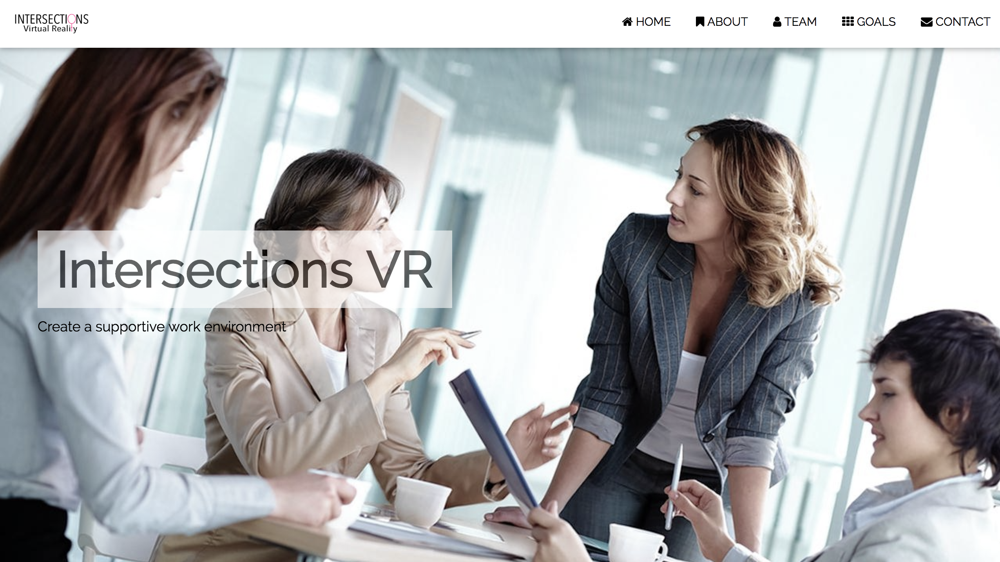
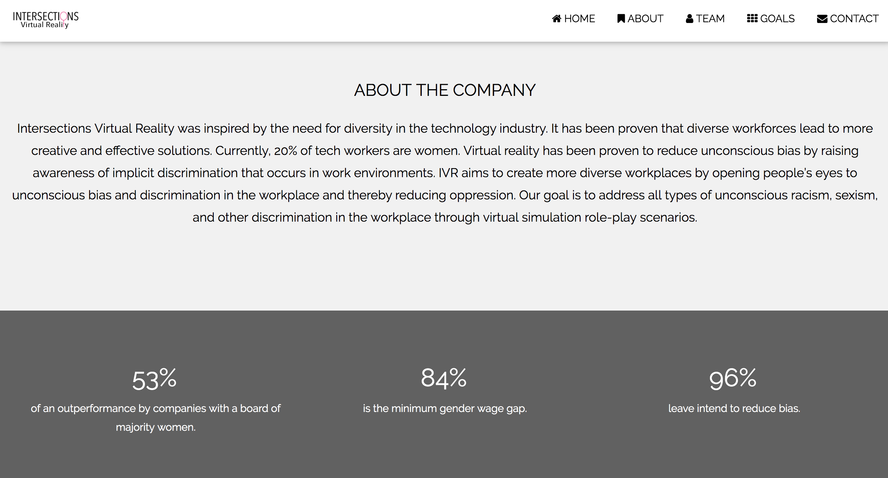
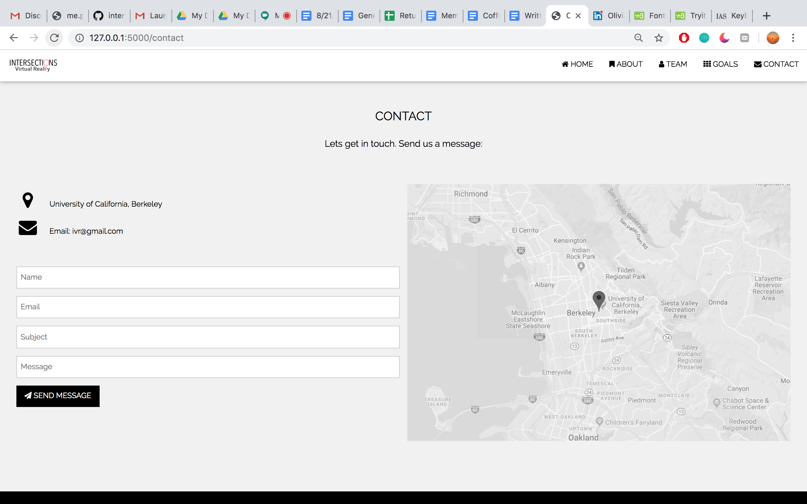

IntersectionsVR seeks to use VR in unconscious bias trainings to aim to more effectively eliminate bias in the work place. Met with software engineers across major companies including Google to discuss the need for better training to promote an equal workplace.

Second Round CITRUS Foundry Foundation.

1. Home

2. About

3. Team

4. Contact

